<div style="text-align: center"><h1>Rangkuman Week 1</h1></div>
<!-- ========================Bagian CLI======================== -->
&nbsp;

## Unix Command Line

> #### Command Line Interface & Shell
> &nbsp;&nbsp;&nbsp;&nbsp;CLI atau ***Command Line Interface*** adalah antarmuka bagi pengguna untuk mengirim dan menerima perintah dalam bentuk baris teks. ***Shell*** merupakan *tools* atau alat penghubung antar *user* dengan sistem operasi.  Seperti layaknya translator/penerjemah bahasa untuk berinteraksi dengan sistem operasi pada komputer, umummnya shell menyediakan perintah-perintah yang berbasis text yang berjalan pada console terminal yang ada di CLI.

&nbsp;

> #### File System
>
> &nbsp;&nbsp;&nbsp;&nbsp;**_File System_** adalah bentuk Struktur direktori didalam komputer kita. Pada setiap Sistem operasi memiliki cara yang berbeda dalam melakukan manajemen direktorinya.

<!-- gambar -->

&nbsp;
Contoh file system pada linux:

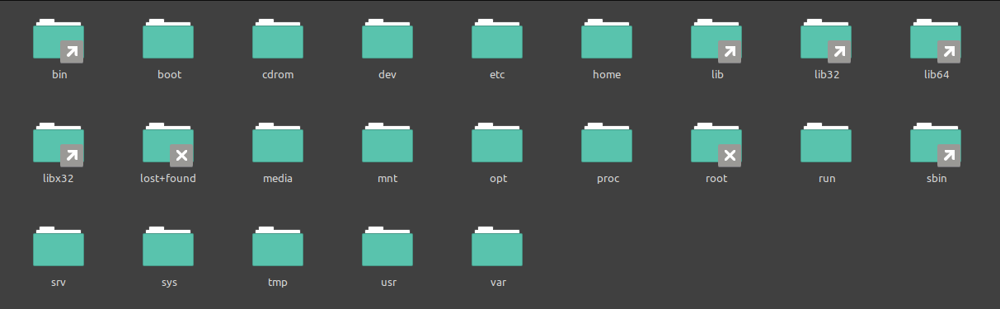

<div style="text-align: center">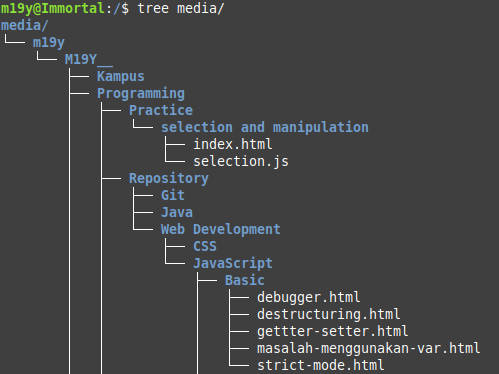</div>

&nbsp;

#### Shell Command

Shell command yang sering digunakan:

<!-- table -->

| Command |                         Keterangan                          |
| ------- | :---------------------------------------------------------: |
| `cd`    | Berpindah dari satu _directory_ ke _directory_ yang lainnya |
| `mkdir` |                 Membuat sebuah folder baru                  |
| `ls`    |               Melihat isi dari sebuah folder                |
| `pwd`   |         Melihat lokasi _current working directory_          |
| `mv`    |          Memindahkan file atau mengubah nama file           |
| `cp`    |          membuat copy dari sebuah file atau folder          |
| `touch` |                   Membuat satu file baru                    |
| `cat`   |                  Melihat seluruh isi file                   |
| `head`  |        Melihat isi yang paling atas dari sebuah file        |
| `tail`  |       Melihat isi yang paling bawah dari sebuah file        |

<!-- ========================Bagian Git & GitHub======================== -->

&nbsp;

## Git & GitHub

> #### Git dan Github
>
> &nbsp;&nbsp;&nbsp;&nbsp;Git adalah _software_ yang bertugas menyimpan catatan perubahan pada seluruh file atau _repository_ dalam suatu project. Sedangkan GitHub adalah situs web yang menyediakan layanan _cloud_ yang mengizinkan pengguna untuk menyimpan, mengolah dan mengembangkan code yang mereka miliki baik secara individu maupun berkelompok.
>
> &nbsp;&nbsp;&nbsp;&nbsp;Git adalah tools yang bisa melalukan perubahan secara lokal dengan menggunakan _command line interface_ yang hanya bisa diakses oleh dirinya sendiri (_programmer_), sedangkan GitHub dapat melakukan perubahan secara global menggunakan _graphical Interface_ dan dapat diakses kepada siapa saja yang diberi izin akses.

&nbsp;

> #### Kenapa Git dan GiHub wajib digunakan?
>
> &nbsp;&nbsp;&nbsp;&nbsp;Git dan GitHub adalah tools yang wajib digunakan oleh seorang perogrammer, dikarenakan git dan github dapat melakukan manajemen penyimpanan catatan perubahan dengan baik. Sesorang programmer bisa melihat kapan dan siapa saja yang melakukan perubahan baik yang dilakukan dirinya sendiri maupun orang lain.

&nbsp;

#### Step by step create, cloning dan push repository

&nbsp;
**1. Membuat repository local sampai dengan commit menggunakan git**

&nbsp;&nbsp;membuat folder menjadi sebuah repository local git:

> ```git
> git init
> ```

&nbsp;&nbsp;mengecek perubahan yang terjadi pada local repository:

> ```git
> git status
> ```

&nbsp;&nbsp;menambahkan perubahan pada staging area:

> ```git
> git add <file-name>
> ```

&nbsp;&nbsp;atau bisa dengan menggunakan titik (.) untuk menambahkan seluruh perubahan pada staging area:

> ```git
> git add .
> ```

&nbsp;&nbsp;melakukan save atau commit:

> ```git
> git commit -m "pesan commit" .
> ```

&nbsp;
**2. Clone repository dari GitHub**

&nbsp;&nbsp;copy link repository bisa menggunakan HTTPS atau SSH:

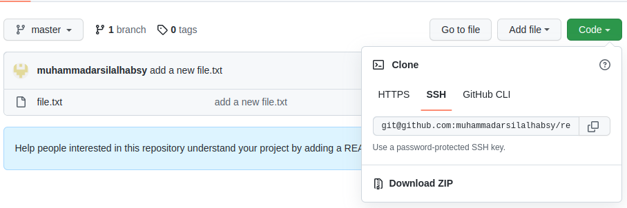

&nbsp;&nbsp;cloning menggunakan terminal:

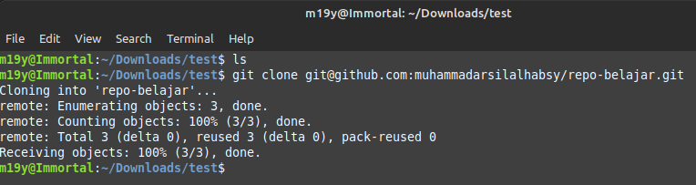

&nbsp;
**3. Push repository local ke GitHub**

&nbsp;&nbsp;push perubahan menggunakan remote origin:

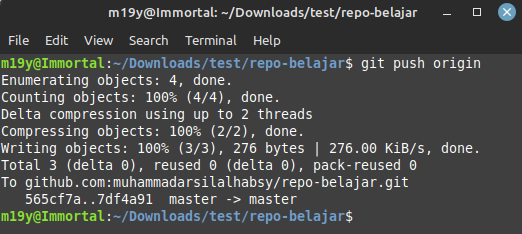
secara default git repo lokal kita akan memiliki remote origin apa bila sudah di clone terlebih dahulu dari cloud provider **_GitHub_**.

<!-- ========================Bagian HTML======================== -->

&nbsp;

## HTML

#### Peran HTML

> &nbsp;&nbsp;&nbsp;HTML atau HyperText Markup Language diistilahkan seperti fondasi atau struktur dasar dalam pembuatan suatu web. Fungsi utama HTML dalam web development adalah membuat halaman/page di web.

#### Tools pendukung

    1. Text editor (Visual Studio Code)
    2. Web Browser (Chrome, Firefox, ect)

#### Tag didalam `<head></head>`

- `<meta>`

  > meta digunakan untuk mendeskripsikan tentang website kita, juga mempermudah search enggine mengidentifikasi website kita

- `<title></title>`
  > tag ini digunakan untuk memberi nama pada website kita

#### Tag didalam `<body></body>`

Ada banyak tag yang bisa di masukan didalam body diantaranya:

- text
  `<h1>, <h2>, <h3>, ..., <p> ...`
- pendukung text
  `<br>, <hr>, <em>, <strong>, ...`
- gambar
  ``
- hyper link
  `<a>`
- list (bulets & numbering)
  `<ul>, <ol>, <li>, <dl>, <dt>, <dd>,`
- table
  `<table>, <thead>, <tbody>`
- form
  `<form>, <input>, <select>, <button> ...`
- script
  `<script>`
- object
  `<object>`
- grouping
  `<div>, <span>`

#### Structure tag

#### `<namatag attribute="nilai">`

contoh:

> `<div class="pembungkus"></div>`

> &nbsp;&nbsp;&nbsp;&nbsp;attribute yang bisa digunakan:
>
> - acceskey
> - id
> - class
> - dir
> - land
> - style
> - tabindex
> - title

#### Penggunaan tag `<h1> - <h6>`

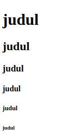

#### Tag list

- **ol (ordered list)**
  code:
  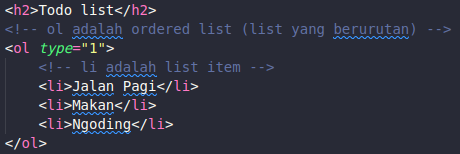
  result:
  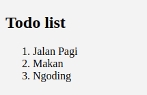

- **ul (unordered list)**
  code:
  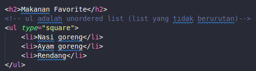
  result:
  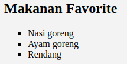

- **dl (definition list)**
  code:
  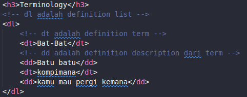
  result:
  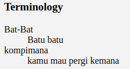

#### Program Todo List HTML sederhana

```html
<!DOCTYPE html>
<html lang="en">
  <head>
    <meta charset="UTF-8" />
    <meta http-equiv="X-UA-Compatible" content="IE=edge" />
    <meta name="viewport" content="width=device-width, initial-scale=1.0" />
    <title>Todo list</title>
  </head>
  <body>
    <h1>Todo List</h1>
    <h3>Makanan Favorite</h3>
    <ul>
      <li>Nasi Goreng</li>
      
      <li>Sate kambing</li>
      
    </ul>
  </body>
</html>
```

hasil preview:
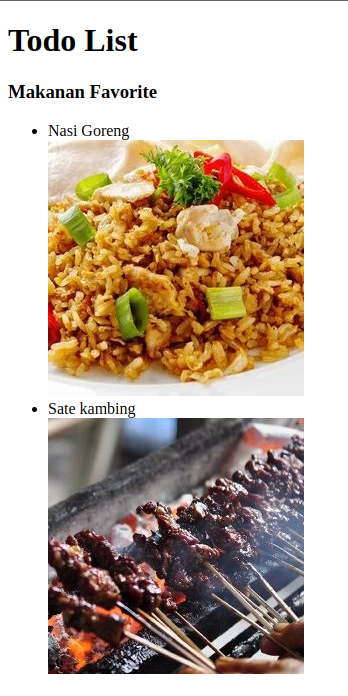

#### Semantic HTML

> [Semantik](https://www.w3schools.com/html/html5_semantic_elements.asp) html adalah tag html yang digunakan sesuai nama dan tempatnya, yang dapat dimengerti oleh browser dan developer itu sendiri. Ada beberapa tag semantik dalam html diantaranya:
>
> - `<haader>`
> - `<section>`
> - `<article>`
> - `<footer>`
> - dan lain lain

#### Contoh penggunaan HTML semantic tag

```html
<!DOCTYPE html>
<html lang="en">
  <head>
    <meta charset="UTF-8" />
    <meta http-equiv="X-UA-Compatible" content="IE=edge" />
    <meta name="viewport" content="width=device-width, initial-scale=1.0" />
    <title>Semantik HTML</title>
  </head>
  <body>
    <header style="text-align: center;">
      <h1>JUDUL UNTUK WEB</h1>
      <a href="">Logo</a>
    </header>

    <section>
      <h3>Judul Section</h3>
      <p>
        Lorem ipsum dolor sit amet consectetur adipisicing elit. Odio architecto
        obcaecati omnis consequuntur sint voluptate quam reiciendis? In
        accusantium, fugiat, molestiae laboriosam perferendis autem quaerat odio
        error, illum iusto obcaecati.
      </p>
    </section>

    <article>
      <h3>Judul Artikel</h3>
      Lorem ipsum dolor sit amet consectetur adipisicing elit. Quasi non nam
      voluptates aut laborum amet fuga, voluptatum natus corrupti quis
      asperiores numquam. Ab labore in soluta, accusamus veniam ad libero.
    </article>

    <footer>
      <p>Contact me</p>
      <p><a href="">muhammadarsilalhabsy@gmail.com</a></p>
    </footer>
  </body>
</html>
```

hasil preview:
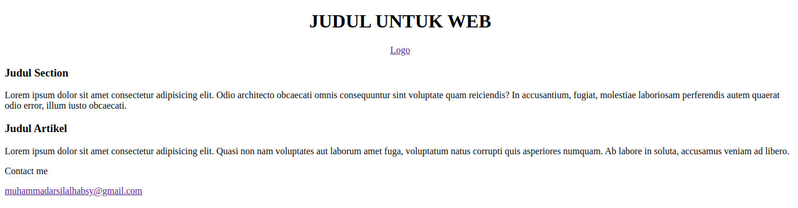

<!-- ========================Bagian CSS======================== -->

&nbsp;

## CSS

#### Peran CSS

> &nbsp;&nbsp;&nbsp;Fungsi utama CSS atau Cascading Style Sheets dalam web development adalah membuat halaman web page lebih menarik dengan pemberian warna dan tata letak atau layouting yang mudah dimengerti oleh user/pengguna. Tanpa style dari CSS web page tidak akan menarik dan membosankan yang hanya berisikan plain text dengan background putih polos.

#### Ada 3 cara untuk menyisipkan CSS pada HTML

**1. Innerline CSS**

> Dilakukan langsung kedalam tag html
> contoh:
>
> ```html
> <h1 style="color: red">Warna Text akan menjadi merah</h1>
> ```

**2. Internal CSS**

> Dilakukan dengan menambahkan tag `<style></style>` di dalam tag head dan biasanya dibawah tag title
> contoh:
>
> ```html
> <style>
>   h1 {
>     color: blue;
>   }
> </style>
> ```

**3. External CSS**

> Dilakukan dengan menambahkan tag `<link>` di dalam tag head dan biasanya dibawah tag title
> contoh:
>
> ```html
> <link rel="stylesheet" href="style.css" />
> ```

#### CSS Sintax

> 3 aturan kata kunci dalam penggunaan syntax CSS
>
> 1. selector
> 2. property
> 3. value
>
> ```
> selector {property:value;}
> ```
>
> contoh penggunaan syntax CSS
>
> ```css
> h1 {
>   color: red;
> }
> ```
>
> Property dan value itu disebut declaration, dalam satu selection kita bisa menambahkan beberapa declaration dengan pemisa "titik koma" ( ; )
> contoh:
>
> ```css
> h1 {
>   background-color: lightgreen;
>   color: red;
>   text-align: center;
> }
> ```
>
> Arti dari code diatas, css tolong berikan warna **_merah_** pada tulisan yang ada di tag h1, dan background-color **_lightgreen_**, kemudian posisikan dia di **_tengah-tengah_**.
>
> hasilnya akan seperti ini:
> 

#### CSS Flex box

> ```html
> <!DOCTYPE html>
>
> <html lang="en">
>   <head>
>     <meta charset="UTF-8" />
>     <meta http-equiv="X-UA-Compatible" content="IE=edge" />
>     <meta name="viewport" content="width=device-width, initial-scale=1.0" />
>     <title>Latihan Flex box</title>
>     <style>
>       .pembungkus {
>         display: flex;
>         border: 5px black;
>         padding: 10px auto;
>         justify-content: space-between;
>       }
>
>       .merah {
>         width: 200px;
>         height: 200px;
>         background-color: red;
>       }
>
>       .hijau {
>         width: 200px;
>         height: 200px;
>         background-color: green;
>       }
>
>       .biru {
>         width: 200px;
>         height: 200px;
>         background-color: blue;
>       }
>     </style>
>   </head>
>   <body>
>     <div class="pembungkus">
>       <div class="merah"></div>
>       <div class="hijau"></div>
>       <div class="biru"></div>
>     </div>
>   </body>
> </html>
> ```
>
> hasilnya akan seperti ini:
> 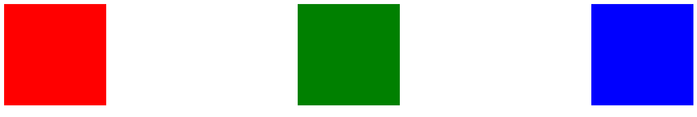

<!-- ========================Bagian CSS======================== -->

&nbsp;

## Algoritma

> #### Algortima dan Data Structures
>
> &nbsp;&nbsp;&nbsp;&nbsp;Algortma adalah langkah-langkah yang dirangkai secara berurutan dengan tujuan menyelesaikan masalah pemograman komputer. Sedangkan Data Structures adalah format khusus untuk mengatur, memproses, mengambil, dan menyimpan data.
> &nbsp;&nbsp;&nbsp;&nbsp;Manfaat penggunaan algoritma bagi seorang programmer adalah mengasah cara berpikir dan analisis menjadi lebih kuat, sedangkan manfaat dari data structur adalah untuk menyimpan dan mengatur data menjadi lebih efisien, rapi dan terorganisir

#### Contoh algoritma sederhana

1. contoh pembuatan algoritma menggunakan pseudocode mencari string pada sebuah array campuran

```
  start:
    loop
      if (array == "abcd")
        return true
      else:
        return false
  end:
```

2. contoh pembuatan algoritma dengan menggunakan bahasa pemogramman JavaScript:

> ```js
> let array = [1, 3, "z", 5, 4, "x", 6, "y", 2];
>
> function findChar(array) {
>   for (let i = 0; i < array.length; i++) {
>     if (isNaN(array[i])) {
>       console.info(`we found "${array[i]}" at index ${i}`);
>     }
>   }
>   return `no character found in this array`;
> }
>
> findChar(array);
> ```

<!-- ========================Bagian CSS======================== -->

&nbsp;

## JavaScript Dasar

> #### Peran
>
> &nbsp;&nbsp;&nbsp;&nbsp;JavaScript atau JS adalah salah satu bahasa pemograman yang dibuat khusus untuk web development, fungsi JS sendiri adalah merangkai HTML dan CSS menjadi lebih menarik. JavaScript bisa di ibaratkan seperti syaraf-syaraf atau otak pengerak yang mengerakan tubuh manusia, yang mampu mengerakan struktur pada tubuh manusia seperti mengerakan pergelangan tangan, membentuk raut wajah, berlari dan sebagainya.

> #### Tipe data JavaScript
>
> - String
> - Integer atau Number
> - Float
> - Boolean
> - Object
>
> &nbsp;&nbsp;&nbsp;&nbsp;Tipe data memiliki fungsi dan perannya masing masin. sebagai contoh tipe data number (1,2,3 ... dst) itu disebut number, Boolean adalah tipe data yang mengembalikan nilai kebenaran "true" atau "false"

> #### Syntax JavaScript
>
> ```js
> const scoore = 3.9;
>
> if (scoore > 3.4) {
>   console.info("lulus dengan predikat cumlaude");
> } else {
>   console.info("lulus");
> }
> ```
