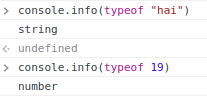
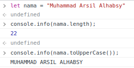
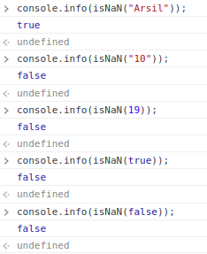
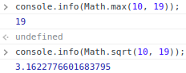

<div style="text-align: center"><h1>Rangkuman Week 2</h1></div>
<!-- ========================Bagian CLI======================== -->
&nbsp;

## Scope And Function

> &nbsp;&nbsp;&nbsp;&nbsp;Scope adalah batasan atau area akses sebuah data. JavaScript memiliki 2 (dua) buah akses scope yaitu local dan global scope. Data yang ada di global scope dapat dengan mudah diakses oleh local scope, sedangakan local scope sebaliknya data dari local scope tidak bisa diakses oleh global scope. scope biasanya digunakan pada sebuah function dengan tanda kurung kribo.
>
> &nbsp;&nbsp;&nbsp;&nbsp;Function adalah block code yang bertugas dengan tujuan tertentu dan akan berjalan saat kita memanggilnya
>
> Contoh penggunaan scope pada function:
>
> ```
> function namaFunction() {
>   // kode
> }
> ```
>
> Contoh function mendapatkan keliling persegi dan luas persegi panjang
>
> ```js
> function luasPersegi(panjang, lebar) {
>   return panjang * lebar;
> }
>
> function kelilingPersegi(panjang, lebar) {
>   return (panjang + lebar) * 2;
> }
> ```

&nbsp;

## Data Type Built in Prototype & Method

#### Tipe data JavaScript

> &nbsp;&nbsp;&nbsp;&nbsp;JavaScript termasuk bahasa pemograman yang memiliki tipe data yang dinamic yang dimana setiap variable bisa memiliki nilai yang berubah ubah, namun dibalik kelebihannya yang memiliki tipe data yang dinamic variable di JavaScript juga termasuk lemah karena memiliki kemungkinan error baik saat melakukan konversi maupun melakukan operasi matematik.
>
> &nbsp;&nbsp;&nbsp;&nbsp; Berikut tipe data yang ada pada JavaScript:
>
> 1. Primitive data type
>
> - String
> - Number
> - Boolean
> - Null
> - Undefined
>
> 2. Non primitive data type
>
> - Object
> - Array

#### Type of

> &nbsp;&nbsp;&nbsp;&nbsp;Type of adalah kata kunci yang disediakan JavaScript untuk mengetahui tipe data apa yang kita gunakan saat ini. contoh penggunaannya ` console.info(typeof "hai")` akan mengembalikan type data `String` dan ` console.info(typeof 19)` akan mengembalikan type data `Number`
>
> Code:
>
> 

#### String Property and Method

> &nbsp;&nbsp;&nbsp;&nbsp;String property and method adalah property dan method yang disediakan oleh JavaScript secara default yang berfungsi untuk memudahkan kita saat proses development website. `.length`, `toUpperCase()`, `.indexOf()`dan `.split()` adalah salah satu dari banyak property dan method yang disediakan oleh JavaScript.
>
> Code:
>
> 

#### Number Property and Method

> &nbsp;&nbsp;&nbsp;&nbsp;Selain type data String, Number juga memiliki property dan methodnya sendiri, salah satu method yang bisa digunakan pada number adalah `.isNaN()`,`Math.max()` dan `Math.sqrt()`
>
> Code:
>
> 
>
> 
>
> &nbsp;&nbsp;&nbsp;&nbsp;Method `.isNaN()` akan mengecek apakah argument yang dikirimkan bukanlah number, kalau yang dikirimkan sebuah angka ataupun boolean itu akan mengembalikan `false`. sebaliknya apabila mengirimkan sebuah string value itu akan mengembalikan `true`
