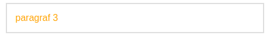

<div style="text-align: center"><h1>Rangkuman Week 2</h1></div>
<!-- ========================Bagian CLI======================== -->
&nbsp;

## Scope And Function

> &nbsp;&nbsp;&nbsp;&nbsp;Scope adalah batasan atau area akses sebuah data. JavaScript memiliki 2 (dua) buah akses scope yaitu local dan global scope. Data yang ada di global scope dapat dengan mudah diakses oleh local scope, sedangakan local scope sebaliknya data dari local scope tidak bisa diakses oleh global scope. scope biasanya digunakan pada sebuah function dengan tanda kurung kribo.
>
> &nbsp;&nbsp;&nbsp;&nbsp;Function adalah block code yang bertugas dengan tujuan tertentu dan akan berjalan saat kita memanggilnya
>
> Contoh penggunaan scope pada function:
>
> ```
> function namaFunction() {
>   // kode
> }
> ```
>
> Contoh function mendapatkan keliling persegi dan luas persegi panjang
>
> ```js
> function luasPersegi(panjang, lebar) {
>   return panjang * lebar;
> }
>
> function kelilingPersegi(panjang, lebar) {
>   return (panjang + lebar) * 2;
> }
> ```

&nbsp;

## Data Type Built in Prototype & Method

#### Tipe data JavaScript

> &nbsp;&nbsp;&nbsp;&nbsp;JavaScript termasuk bahasa pemograman yang memiliki tipe data yang dinamic yang dimana setiap variable bisa memiliki nilai yang berubah ubah, namun dibalik kelebihannya yang memiliki tipe data yang dinamic variable di JavaScript juga termasuk lemah karena memiliki kemungkinan error baik saat melakukan konversi maupun melakukan operasi matematik.
>
> &nbsp;&nbsp;&nbsp;&nbsp; Berikut tipe data yang ada pada JavaScript:
>
> 1. Primitive data type
>
> - String
> - Number
> - Boolean
> - Null
> - Undefined
>
> 2. Non primitive data type
>
> - Object
> - Array

#### Type of

> &nbsp;&nbsp;&nbsp;&nbsp;Type of adalah kata kunci yang disediakan JavaScript untuk mengetahui tipe data apa yang kita gunakan saat ini. contoh penggunaannya ` console.info(typeof "hai")` akan mengembalikan type data `String` dan ` console.info(typeof 19)` akan mengembalikan type data `Number`
>
> Code:
>
> 

#### String Property and Method

> &nbsp;&nbsp;&nbsp;&nbsp;String property and method adalah property dan method yang disediakan oleh JavaScript secara default yang berfungsi untuk memudahkan kita saat proses development website. `.length`, `toUpperCase()`, `.indexOf()`dan `.split()` adalah salah satu dari banyak property dan method yang disediakan oleh JavaScript.
>
> Code:
>
> 

#### Number Property and Method

> &nbsp;&nbsp;&nbsp;&nbsp;Selain type data String, Number juga memiliki property dan methodnya sendiri, salah satu method yang bisa digunakan pada number adalah `.isNaN()`,`Math.max()` dan `Math.sqrt()`
>
> Code:
>
> 
>
> 
>
> &nbsp;&nbsp;&nbsp;&nbsp;Method `.isNaN()` akan mengecek apakah argument yang dikirimkan bukanlah number, kalau yang dikirimkan sebuah angka ataupun boolean itu akan mengembalikan `false`. sebaliknya apabila mengirimkan sebuah string value itu akan mengembalikan `true`

&nbsp;

## DOM

> &nbsp;&nbsp;&nbsp;&nbsp;Document Object Model (DOM) adalah interface lintas platform yang berarti bukan dikhususkan untuk bahasa peogramman JavaScript saja. DOM memperlakukan element HTML atau XML layaknya stuructur pohon dimana setiap node adalah object sebagai perwakilan dari document.

#### Mencari Element

> &nbsp;&nbsp;&nbsp;&nbsp;Ada beberapa cara untuk mencari element diantaranya menggunakan function:
>
> - `document.getElementById(); // mengambil id saja`
> - `document.getElementsByClassName() // mengambil class, dan mengembalikan HTML collection`
> - `document.getElementsByTagName() mengambil tag html dan mengembalikan HTML collection`
> - `document.querySelector() // sama seperti selector css akan mengembalikan sebuah element`
> - `document.querySelectorAll() // sama seperti selector css, dan mengembalikan Node List`

#### Mengubah Content Element

> &nbsp;&nbsp;&nbsp;&nbsp;Ada beberapa cara untuk mengubah content element diantaranya menggunakan property:
>
> - `element.innerHtml = "Arsil" atau "<p>Alhabsy</p>; // bisa digunakan untuk mengubah content dan juga menambahkan tag html baru`
> - `element.textContent = "Muhammad Arsil Alhabsy"; // hanya bisa mengubah text pada tag html, tidak sama seperti innerHtml yang bisa mengubah tag nya juga`
> - `element.innerText = "Muhammad Arsil Alhabsy"; // mengembalikan kontext text dari satu element`
>
> ! Perbedaan antara textContent vs innerText adalah, text content akan mengembalikan tag seperti contoh `<p>Muhammad Arsil Alhabsy</p>` sedangkan innerText hanya mengembalikan text saja seperti contoh "`Muhammad Arsil Alhabsy`"

#### Membuat Element

> &nbsp;&nbsp;&nbsp;&nbsp;Ada beberapa step yang harus dilakukan untuk membuat element baru di html menggunakan DOM:
>
> 1. membuat element
> 2. menambahkan content dan menambahkan content untuk element yang dibuat sebelumnya (opsional)
> 3. menambahkan context ke parent elementnya
>
> berikut alur codingannya:
>
> ;

#### Set dan Get attribute pada Element HTML

> 1. Set
>
> `element.setAttribute("class","human");`
>
> artinya memberikan atribute `class` dengan `value` human pada element. hasilnya akan seperti ini
>
> ```html
> <p class="human">Muhammad Arsil Alhabsy</p>
> ```
>
> 2. Get
>
> `element.getAttribute("class");`
>
> artinya ambil atribute `class` yang ada pada element html
>
> code:
>
> 

#### Memberikan style menggunakan DOM

> &nbsp;&nbsp;&nbsp;&nbsp;berikut salahsatu cara memberikan style pada element dengan menggunakan DOM
>
> ```js
> element.sytel.backgroundColor = "lightgreen";
> ```
>
> hasil:
>
> 
>
> &nbsp;&nbsp;&nbsp;&nbsp;Ada masih banyak lagi property css yang bisa ditambahkan mengunakan dom berikut beberapa penulisan codenya:
>
> - `element.style.height = 20px; // menambahkan tinggi`
> - `element.style.wight = 20px; // menambahkan lebar`
> - `element.style.padding = 20px; // menambahkan padding`
> - dan masih banyak lagi

## DOM Event

> &nbsp;&nbsp;&nbsp;&nbsp;Event pada DOM bertugas menagkap sebuah kejadian yang dilakukan oleh user. Ada beberapa cara untuk menangkap/mendengarkan event diantaranya
>
> - Event Hendler
>   - Inline attribute
>   - Element method
> - addEventListener()

#### Inline Attribute

> &nbsp;&nbsp;&nbsp;&nbsp;Penggunaan Inline attribute bisa dengan cara menambahkan langsung ke atribute dari element html
>
> code:
>
> ```html
> <h1 id="judul" onclick="style='background-color : red'">Hello World</h1>
> ```
>
> result sebelum dan sesudah di klik:
>
> 
>
> 

#### Element Method

> &nbsp;&nbsp;&nbsp;&nbsp;Penggunaan event pada method bisa dengan cara menambahkan salah satu property event `onclick` dengan disertai function yang akan dijalankan.
>
> code :
>
> ```js
> const getP3 = document.getElementsByClassName("p3")[0];
> getP3.onclick = () => {
>   getP3.style.color = "orange";
> };
> ```
>
> result sebelum dan sesudah di klik:
>
> 
>
> 

#### AddEventListener

> &nbsp;&nbsp;&nbsp;&nbsp;Hasil dari code akan sama saja namun lebih disarankan menggunakan `.addEventListener` dibandingkan `event hendler`
>
> code:
>
> ```js
> const getP3 = document.getElementsByClassName("p3")[0];
> getP3.addEventListener("click", () => {
>   getP3.style.color = "orange";
> });
> ```
