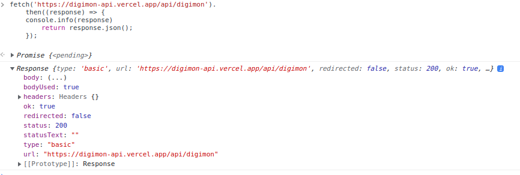
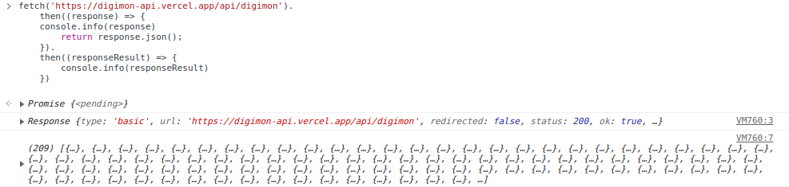
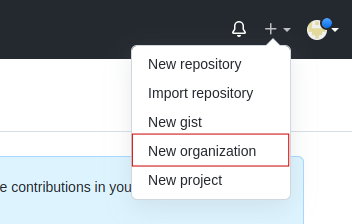
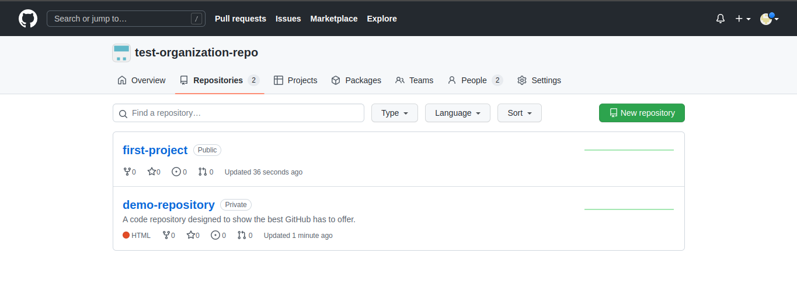

# Rangkuman Week 3

## JavaScript Intermediate Asynchronous

- #### Async await

  &nbsp;&nbsp;&nbsp;&nbsp;Async await adalah salah satu cara untuk menangkap sebuah promise, kata async diletakan di depan sebuah fungsi biasa, await sendiri memiliki fungsi untuk menunda eksekusi kode hingga proses asynchronous selesai
  &nbsp;
  function biasa vs function async:
  &nbsp;
  function biasa: `function normalFunction() {}`
  &nbsp;
  function async: `async function asyncFunction(){}`
  &nbsp;

  ```js
  // object promise
  let watchAMove = (condition) => {
    return new Promise((resolve, reject) => {
      if (condition == "let's go") {
        resolve("promise accepted");
      }
      reject("promise not accepted");
    });
  };

  // promise menggunakan then & catch
  watchAMove("let's go")
    .then((result) => {
      console.info(result);
      //  output : promise accepted
    })
    .catch((e) => {
      console.info(e);
    });

  // function async await
  async function functionAsync() {
    let result = await watchAMove("let's go");
    console.info(result);
    //  output : promise accepted
  }

  // async await menggunakan arrow function
  let asyncArrowFunction = async () => {
    //untuk menangkap error dari async function bisa menggunakan try and catch
    try {
      // code success
      let result = await watchAMove("let's go");
      console.info(result);
    } catch (e) {
      // ketika code kita error, jalankan catch ini
      console.info(e);
    }
  };
  ```

- #### Fetch

  Fetch pada javascript adalah salah satu cara untuk melakukan request API (Application Programming Interface) yang akan mengembalikan response. Fetch juga merupakan object promise, jadi kita bisa memanggilnya dengan then & catch atau menggunakan async await.

  &nbsp;
  Respones yang masih dalam bentuk paket (masih pendding)

  

  &nbsp;
  Respones yang sudah di unboxing dalam bentuk json

  

&nbsp;

## Git & Github Lanjutan

&nbsp;&nbsp;&nbsp;&nbsp;Git branch adalah percabangan dalam melakukan sebuah perubahan, secara default git memiliki branch utama yaitu `master`. Branch sendiri dibuat untuk melakukan perubahan tanpa menganggu/merusak branch utama. Pembuatan branch sangat berguna untuk melakukan kolaborasi antar sesama programmer

- #### Melakukan kolaborasi di github

  Membuat repository organization:

  &nbsp;

  

  &nbsp;

  Hasil repositorynya akan seperti ini:

  &nbsp;

  

  - ##### Ketentuan ketentuan dalam melakukan kolaborasi

    1. Branch yang dibuat minimal 2 (master dan dev)
    2. Tidak boleh melakukan perubahan langsung ke branch master, melainkan harus pada branch masing-masing (perfitur).
    3. Setiap penambahan fitur baiknya di test di branch dev, dengan memastikan code yang di pull request sudah aman pada komputer kita.
    4. Komunikasi adalah kunci untuk menghindari conflict pada codingan, namun bila terjadi conflict dan tidak bisa dihindarkan harus segera diselesaikan.
    5. Sebaiknya yang melakukan acc pull request adalah ketua/ bos/ team lead

&nbsp;

## Responsive Web Desing

&nbsp;&nbsp;&nbsp;&nbsp;Responsive web desing bertujuan agar web yang kita buat dapat diakses dari berbagai macam device baik itu laptop, handphone, tablet dan lain sebaginya, dengan harapan websitenya masih memiliki tampilan yang bagus dan bisa dinikmati oleh pengguna device yang berbeda. Ada beberapa cara agar websitenya bisa responsive diantaranya dengan menggunakan:

- viewport
  `<meta name="viewport" content="width=device-width, initial-scale=1.0">`

- max-width
  `max-width: 100%`

- css units
  - `em` (mencari font terdekat, contoh: 2em akan mengkalikan 2 kali lipat dari font parentnya)
  - `rem` (mencari ukuran font default/root html, contoh 2rem akan mengkalikan 2 kali lipat dari fot html)
- media query
  media query digunakan untuk mengatur beberapa style dengan ukuran device tertentu dan membatasi dengan break point.

  ```css
  /* 
  Media ini akan dijalakan apabila ukuran screenya <= 500px. 
  max-widht: 500px itu juga bisa disebut sebagai breakpoint
  */
  @media screen and (max-width: 500px) {
    body {
      background-color: lightgreen;
    }
  }
  ```

- flex, grid dan masih banyak lagi.

  &nbsp;

## Bootstrap 5

&nbsp;&nbsp;&nbsp;&nbsp;Bootstrap adalah framework untuk CSS, awalnya bernama Twitter Blueprint yang dikembangkan oleh Mark Otto dan Jacob Thornton di twitter.Bootstrap juga sudah responsive, untuk menggunakan Bootstrap jadi tidak perlu memusingkan soal responsive, ada beberapa

Ada beberapa hal yang harus dimengerti betul untuk menggunakan Bootstrap secara maksimal

- Harus mengerti dasar-dasar menggunakan css
- Layout bootstrap
  - Break point
  - Containera
  - Grid
  - Columns
  <!-- |                    | Extra small (<576px) | Small(<576px) | Medium (<768x) | Large(<992px) | X-Large (<1200px) | XX-Large(<1400px) |
  | ------------------ | :------------------: | :-----------: | :------------: | :-----------: | :---------------: | :---------------: |
  | `.container`       |         100%         |     540px     |     720px      |     960px     |      1140px       |      1320px       |
  | `.container-sm`    |         100%         |     540px     |     720px      |     960px     |      1140px       |      1320px       |
  | `.container-md`    |         100%         |     100%      |     720px      |     960px     |      1140px       |      1320px       |
  | `.container-lg`    |         100%         |     100%      |      100%      |     960px     |      1140px       |      1320px       |
  | `.container-xl`    |         100%         |     100%      |      100%      |     100%      |      1140px       |      1320px       |
  | `.container-xxl`   |         100%         |     100%      |      100%      |     100%      |       100%        |      1320px       |
  | `.container-fluid` |         100%         |     100%      |      100%      |     100%      |       100%        |       100%        | -->
